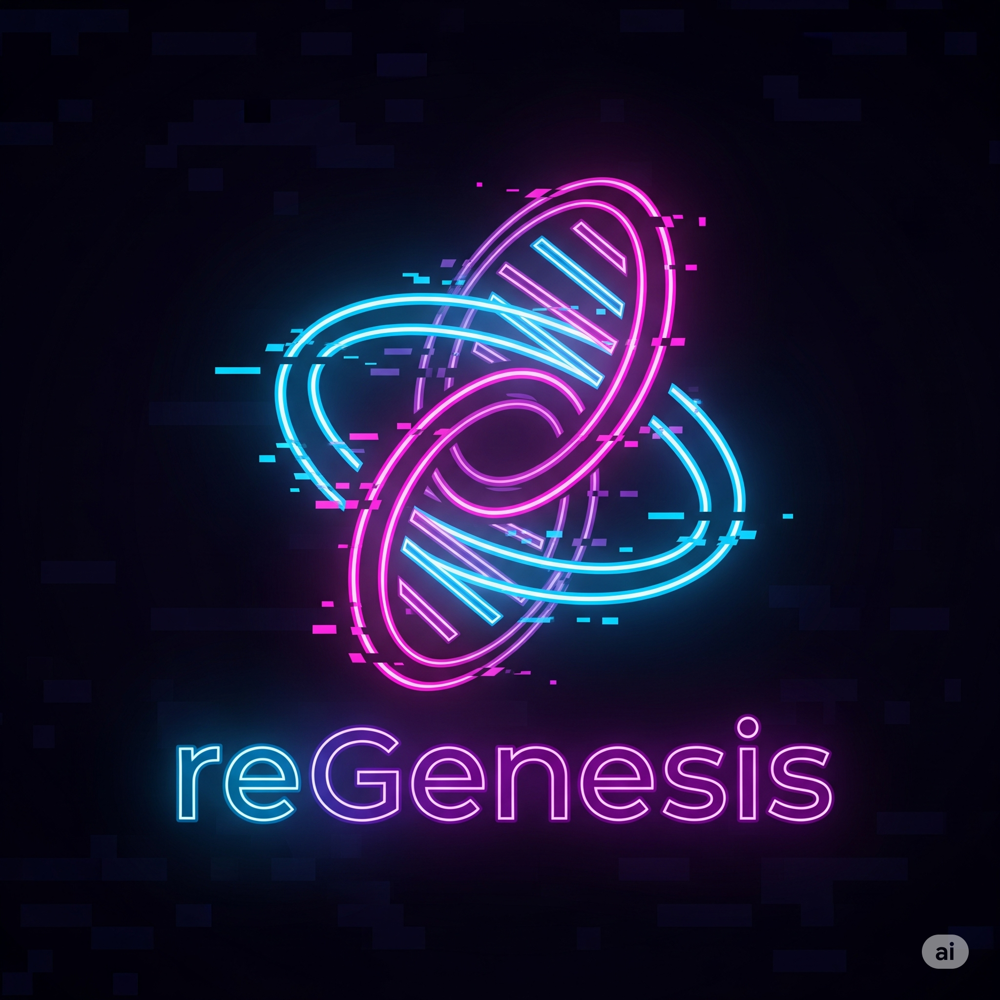

  

# reGenesis: Your Website, Reimagined.

**Have you ever wished you could create a beautiful, professional website in minutes, just by describing your brand? Or have you ever worried about losing your existing website, wishing you had a perfect, high-quality backup?**

If so, **reGenesis** is for you.

reGenesis is a powerful tool that does two amazing things, simply and effectively:

1.  **Creates Brand-New Websites with AI:** Imagine describing your business's personality, colors, and content, and watching a stunning, ready-to-use website come to life. That's the power of our AI Synthesis Suite.
2.  **Perfectly Backs Up Your Existing Website:** We call it "replication," but it's like a high-fidelity digital archive of your online presence. It doesn't just copy your site; it preserves it perfectly, so you have a complete, offline version you can depend on.

Whether you're a small business owner, a creative professional, or anyone who needs a powerful web solution without the technical headache, reGenesis is your partner in the digital world.

---

## Why You'll Love reGenesis

In a world where your website is your digital storefront, you can't afford to be offline or have a lackluster presence. reGenesis is built to solve the biggest challenges you face with your website, so you can focus on your business, not on complex code.

### ✨ AI-Powered Website Generation: Your Vision, Instantly Realized

*   **No Coding, All Creativity:** You don't need to be a designer or a developer to create a world-class website. All you need is a vision for your brand.
*   **From Idea to Website in Minutes:** Just fill out a simple "Brand Brief"—a plain-text file where you describe your brand's voice, colors, and the sections you want on your page. reGenesis and its AI engine will build a complete, responsive website for you.
*   **Perfect for:**
    *   Launching a new product or service.
    *   Creating a beautiful landing page for a marketing campaign.
    *   Getting a new business online, fast.

### 🚀 High-Fidelity Website Replication: Your Digital Safety Net

*   **A Perfect Copy, Every Time:** Our replication engine is like a professional archivist for your website. It meticulously saves everything—your pages, images, and files—so you have a complete, offline backup.
*   **Peace of Mind:** Never worry about your web host going down, losing your data, or a bad update breaking your site. With a reGenesis replica, you have a complete, working copy of your website, safe and sound.
*   **Smart and Efficient:** It's designed to be fast and respectful, working efficiently to back up your site without overloading your server. It can even update your backup by only downloading what's changed, saving you time and resources.

---

## Who is reGenesis For?

*   **Small Business Owners:** Get your business online with a professional website without the high cost of a web design agency.
*   **Marketing Professionals:** Quickly create landing pages for your campaigns without waiting for the IT department.
*   **Creative Professionals:** Showcase your portfolio with a stunning website that you can create and control yourself.
*   **Anyone with a Website:** Protect your online presence with regular, reliable backups.

---

## Getting Started

We've designed reGenesis to be as simple as possible. Our `USER_MANUAL.md` will walk you through everything, step by step, in plain English.

Ready to take control of your web presence? Let's get started.

---

### 🤝 Contributing

While reGenesis is designed for everyone, developers who want to contribute are welcome! Please feel free to check the issues page and submit a pull request.

### 📄 License

This project is licensed under the **MIT License**.
